# Chapter 1. Association Rule Mining

# 1. Basic Concepts

| TID | A | B | C | D | E |
|----|---|---|---|---|---|
| t1 | 1 | 0 | 0 | 1 | 0 |
| t2 | 1 | 1 | 0 | 1 | 1 |
| t3 | 0 | 1 | 1 | 0 | 0 |
| t4 | 1 | 1 | 1 | 1 | 1 |
| t5 | 0 | 1 | 1 | 0 | 1 |

## 1.1 Items and Item Set

**`def` Items and Item Set**

- Single Items: $A, B, C, D, E$
- Item Sets: $\{B, C\}$, $\{A, B, C\}$, $\{A\}$

**`def` Support of an item set** 

The support of an item set refers to the number of records (i.e., frequency) where all the item in the the item set are contained.

```math
\text{supp}(\{A, C\}) = \text{Num. of records contianing both} \ A \ \text{and} \ C
```

> *e.g.* 
>
> Since there are three records that contain both $B$ and $C$, the item set $\{B, C\}$ is called a 3-frequent item set.

## 1.2 Association Rules

**`def` Association Rule**

An implication relation mapping from a set of items to another set of items. An example is as follows:

$$\{B, C\} \rightarrow \{ E \}$$

It is a claim that, a record that contains $B$ and $C$ would also contains $E$.

> Note that the association rule is a claim, not a fact. It may be true for certain records, while it's possible that it's not true for some other records.

**`def` Support of an Association Rule**

The support of an association rule refers to the support of the item set that contains all the referred items in the rule.

$$\text{supp}(\{B, C\} \rightarrow \{E\}) = \text{supp}(\{B, C, E\})$$

**`def` Confidence**

The confidence of an association rule refers to how likely the rule holds. It is measured by the portion of records that fulfilled the rule over the records that fulfilled the antecedent.

$$\text{conf}(\{B, C\} \rightarrow \{E\}) = \frac{\text{supp}(\{B, C, E\})}{\text{supp}(\{B, C\})}$$

# 2. Problem Definition

## 2.0 Special Concepts

We temporarily define some terms to illustrate the problem.

**`def` Large Itemset**

Item sets with a support greater than a threshold.

**`def` Large Association Rules**

Association rules with a support greater than a threshold.

**`def` Interesting Association Rules**

Association rules with a confidence greater than a threshold.

## 2.1 Problem Description

**Given:** A matrix of transaction info.

| A | B | C |
|---|---|---|
| 1 | 1 | 1 |
| 0 | 1 | 0 |
| 1 | 1 | 1 |
| 0 | 1 | 1 |

**Goal:** Find all association rules that are large and interesting.

- i.e., find all association rules with $\text{supp} \geq 3$ and $\text{conf} \geq 50\%$

## 2.2 Problem Solutions

### 2.2.1 Method 1: Naive / Straightforward Method:

**Step 1.** Enumerate all possible rules (find all concepts).

| Rules |
|-------|
| $\{A\} \rightarrow \{B\}$ |
| $\{A\} \rightarrow \{C\}$ |
| $\{B\} \rightarrow \{A\}$ |
| $\{B\} \rightarrow \{C\}$ |
| $\{C\} \rightarrow \{A\}$ |
| $\{C\} \rightarrow \{B\}$ |
| $\{A, B\} \rightarrow \{C\}$ |
| ... |

**Step 2.** Compute support and confidence of each rule.

| Rules | Supp | Conf |
|-------|------|------|
| $\{A\} \rightarrow \{B\}$ | 2 | $\frac{2}{2}=1.0$ |
| $\{A\} \rightarrow \{C\}$ | 2 | $\frac{2}{2}=1.0$ |
| $\{B\} \rightarrow \{A\}$ | 2 | $\frac{2}{4}=0.5$ |
| $\{B\} \rightarrow \{C\}$ | 3 | $\frac{3}{4}=0.75$ |
| $\{C\} \rightarrow \{A\}$ | 2 | $\frac{2}{2}=1.0$ |
| $\{C\} \rightarrow \{B\}$ | 3 | $\frac{2}{2}=1.0$ |
| $\{A, B\} \rightarrow \{C\}$ | 2 | $\frac{2}{2}=1.0$ |
| ... |


**Step 3.** Select a set of rules $R$ with $\text{supp}(r) \geq 3$ and $\text{conf}(r) \geq 50\%$, for all $r\in R$.

**Output:** $S_{0}$, the required set of association rules.

### 2.2.2 Method 2: Two-step method

**Step 1.** Generate all large item sets (supp >= 3).

> (Find all concepts, certifying one condition) More difficult, exponential.

*Step 1.1* Find all item sets.

*Step 1.2* Compute all the supports.

| Item Sets | Supp | Large? |
|-----------|------|--------|
| $\{A\}$ | 2 | NO |
| $\{B\}$ | 4 | YES |
| $\{C\}$ | 3 | YES |
| $\{A, B\}$ | 2 | NO |
| $\{A, C\}$ | 2 | NO |
| $\{B, C\}$ | 3 | YES |
| $\{A, B, C\}$ | 2 | NO |

*Step 1.3* Filter out the non-"large" ones (< 3).

| Item Sets | Supp | Large? |
|-----------|------|--------|
| $\{B\}$ | 4 | YES |
| $\{C\}$ | 3 | YES |
| $\{B, C\}$ | 3 | YES |

**Output:** $S_{1}$

**Step 2.** Generate a set of rules with conf >= 50%.

*Step 2.1* For any two item sets in $S_{1}$, being $X$ and $Y$, where $X \subseteq Y $:

If $\frac{\text{supp}(Y)}{\text{supp}(X)} \geq 50\%$ then:

Generate $X \rightarrow Y - X$

> Why subset? 
>
> Remark: $\text{conf}(\{B\} \rightarrow \{C\}) = \frac{\text{supp}(\{B, C\})}{\text{supp}(\{B\})}$. Here, $X$ is $\{C\}$ while $Y$ is $\{B, C\}$.
> 
> Larger set, more specifications, less occurances.

**Output:** $S_{2}$.

## 2.3 Equivalence of the two methods

**`claim`** The two methods generates the same set of outputs:

$$S_{2} = S_{0}$$

---

**`proof`** $S_{2}=S_{0}$

Proving $S_{2}=S_{0}$ is equivalent to proving:

$$S_{2} \subset S_{0} \land S_{0} \subset S_{2}$$

Which is further equivalent to proving:

$$(r \in S_{2} \implies r \in S_{0}) \land (r \in S_{0} \implies r \in S_{2})$$

Note that two sets are rule sets.

---

**Sub-proof 1:** $(r \in S_{2} \implies r \in S_{0})$

Suppose that $r = (I_{1} \rightarrow I_{2})$ is a rule in $S_{2}$, where $I_{1}, I_{2}$ are item sets.

$r \in S_{2}$

$\implies (\text{conf}(r) \geq 50\%) \land (I_{1} \cup I_{2}, I_{1} \in S_{1})$

---

*Sub-proof 1 - Branch 1:*

```math
I_{1} \cup I_{2}, I_{1} \in S_{1} \implies \text{supp}(I_{1} \cup I_{2}) \geq 3 \land \text{supp}(I_{2}) \geq 3
```

Since $\text{supp}(I_{1} \cup I_{2}) \geq 3$ and $\text{supp}(I_{1} \rightarrow I_{2}) = \text{supp}(I_{1} \cup I_{2})$, we have:

```math
\text{supp}(I_{1} \rightarrow I_{2}) \geq 3
```

namely,

```math
\text{supp}(r) \geq 3
```

The rule is large.

---

*Sub-proof 1 - Branch 2:*

For $\text{conf}(r) \geq 50\%$ and $\text{supp}(r) \geq 3$, the rule $r$ is both large and interesting. Therefore, $r \in S_{0}$.

---

**Sub-proof 2:** $(r \in S_{0} \implies r \in S_{2})$

Suppose that $r = (I_{1} \rightarrow I_{2})$ is a rule in $S_{2}$, where $I_{1}, I_{2}$ are item sets.

```math
\begin{align}
&r \in S_{0} \\

\implies& (\text{supp}(r) \geq 3) \land (\text{conf}(r) \geq 50\%) \\

\implies& (\text{supp}(I_{1} \rightarrow I_{2}) \geq 3) \land (\text{conf}(I_{1} \rightarrow I_{2}) \geq 50\%) \\

\implies& (\text{supp}(I_{1} \cup I_{2}) \geq 3) \land (\frac{\text{supp}(I_{1} \cup I_{2})}{\text{supp}(I_{1})} \geq 50\%)

\end{align}
```

---

*Sub-proof 2 - Branch 1:*

There's a trivial property:

```math
\text{supp}(I_{1}) \geq \text{supp}(I_{1} \cup I_{2})
```

Having $\text{supp}(I_{1} \cup I_{2}) \geq 3$, we can conclude that:

$$\text{supp}(I_{1}) \geq \text{supp}(I_{1} \cup I_{2}) \geq 3$$

Generally, both $I_{1}$ and $I_{1} \cup I_{2}$ are large. Therefore:

$$I_{1}, I_{1} \cup I_{2} \in S_{1}$$

---

*Sub-proof 2 - Branch 2:*

With $I_{1}, I_{1} \cup I_{2} \in S_{1}$, **Step 2** must consider $I_{1}$ and $I_{1} \cup I_{2}$.

Since $\text{conf}(I_{1} \rightarrow I_{2}) \geq 50\%$, **Step 2** must generate $I_{1} \rightarrow I_{2}$. Namely, **Step 2** must generate $r$.

Therefore, $r \in S_{2}$.

---

**Proof Summary**

By **Sub-proof 1**, we have $r \in S_{2} \implies r \in S_{0}$, namely, $S_{2} \subset S_{0}$.

By **Sub-proof 2**, we have $r \in S_{0} \implies r \in S_{2}$, namely, $S_{0} \subset S_{2}$.

To sum up, $S_{2} \subset S_{0} \land S_{0} \subset S_{2}$. By definition, $S_{2}=S_{0}$.

**Qed.**

---

# 3. NP-Hardness

## 3.1 Breaking Down Step 1 of Method 2

In 2.2.2 Method 2, we focus on the **Step 1.**, which is harder to compute than **Step 2.**. In fact, **Step 1.** is NP-hard.

**`recap`** The **Step 1.** is:

- Find all large item sets (supp $\geq 3$)

Which is equivalent to:

- Find all large (supp $\geq 3$) J-size item set for each positive int J.

Breaking down this question, we get:

**INSTANCE:** Given a db of transaction records.

**QUESTION:** Is there a f-frequent item set of size J?

|    | Egg | Rice | Oil | Juice |
|----|----|------|-----|-------|
| T1 | 1 | 1 | 1 | 0 | 
| T2 | 0 | 1 | 1 | 0 | 
| T3 | 0 | 1 | 1 | 1 | 
| T4 | 0 | 1 | 1 | 0 | 

We'll show that this problem is NP-hard.

## 3.2 An NP-Complete Problem

**INSTANCE:** Given a bipartite graph $G=(V, E)$, and a positive integer $K \leq |V|$.

**QUESTION:** Are there two disjoint subsets $V_{1}, V_{2} \subseteq V$ s.t. $|V_{1}| = |V_{2}| = K$, and $\forall u\in V_{1}, v \in V_{2}, \{u, v\} \in E$?

- i.e., any subgraph within this bipartite that's also a bipartite?

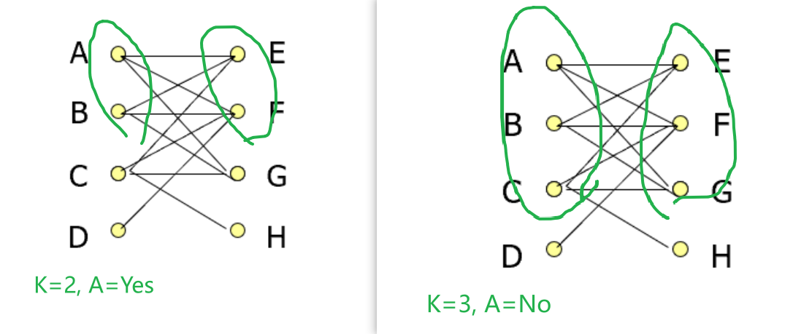

It is proven by magic that this problem is **NP-Complete.**

## 3.3 Equivalence of Two Problems

Finding the solution in the bipartite problem is equivalent to finding the solution of "large set finding" Since the bipartite problem is NP-Complete, the "large set finding" is also NP-Complete.

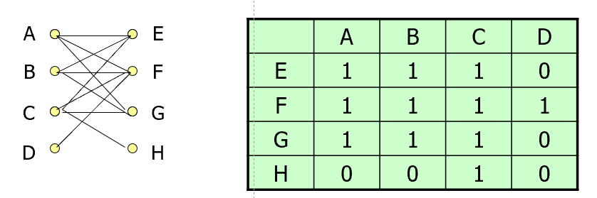

**`summary`** To prove that a problem is NP-complete:

**Step 1.** Find an existing NP-complete problem.

**Step 2.** Transform this NP-complete problem to P in polynomial time.

**Step 3.** Show that solving the new prob. is equivalent to solving the original prob.

# 4. Algorithm Apriori

| TID | A | B | C | D | E |
|----|---|---|---|---|---|
| t1 | 1 | 0 | 0 | 1 | 0 |
| t2 | 1 | 0 | 0 | 1 | 1 |
| t3 | 0 | 0 | 1 | 0 | 0 |
| t4 | 1 | 0 | 1 | 1 | 1 |
| t5 | 1 | 0 | 1 | 0 | 1 |

**`prop` 1** If an item set $S$ is large, all of its proper **subset** must be large.

- If we know that $\{B, C\}$ is large, we know that both $\{B\}$ and $\{C\}$ is large.

**`prop` 2** If an item set $S$ is not large, then any of its proper **super-set** must not be large.

- If we know that $\{B, C, E\}$ is not large, then we know that $\{A, B, C, E\}$ is definitely not large.

Note that these two properties allow us to infer that an item set is large or not large, without inspecting each item  (i.e., scanning the hard disk).

Problem: We define "large" item sets to be item sets with size over 2. Find all large item sets.

## 4.0 Step 0. Deduce the Item Set

Select out the items with the frequency $\geq 3$, i.e., large items.

<table>
<tr>
    <th>Item-Frequency</th>
    <th>Deduced Items</th>
</tr>
<tr><td>

| Item | Feq | Large? |
|------|-----|--------|
| A    | 4   | YES |
| B    | 0   | NO |
| C    | 3   | YES |
| D    | 3   | YES |
| E    | 3   | YES |

</td><td>

| Item | Feq |
|------|-----|
| A    | 4   |
| C    | 3   |
| D    | 3   |
| E    | 3   |

</td></tr> </table>

**Why?** By property 2, any non-large item's proper super-set is also non-large. Therefore, any set that contians a non-large item is definitely not large.

## 4.1 Large Size-1 Itemset Generation

For all large items, construct a 1-item set. These size-1 item sets are combined to $L_{1}$.

```math
L_{1} = \{\{A\}, \{C\}, \{D\}, \{E\}\}
```

## 4.2 Large Size-2 Itemset Generation

### 4.2.1 Join & Prune Step

Generate all possible pairs of 1-size itemsets as candidates.

```math
C_{2} = \{\{A, C\}, \{A, D\}, \{A, E\}, \{C, D\}, \{C, E\}, \{D, E\}\}
```

### 4.2.2 Counting Step

Counting candidates in $C_{2}$ from the database, we get:

| Item Set | Frequency | Large? |
|----------|-----------|--------|
| $\{A, C\}$ | 2 | YES |
| $\{A, D\}$ | 3 | YES |
| $\{A, E\}$ | 3 | YES |
| $\{C, D\}$ | 1 | NO |
| $\{C, E\}$ | 2 | Yes |
| $\{D, E\}$ | 2 | Yes |

We've veirified that the candidate $\{C, D\}$ is not large, we'll remove it from the candidate. We now generated the size-2 item set.

```math
L_{2} = \{\{A, C\}, \{A, D\}, \{A, E\}, \{C, E\}, \{D, E\}\}
```

## 4.3 Large Size-3 Itemset Generation

### 4.3.1 Join Step

**`def` Prefix of an itemset**

The prefix of an itemset, is its subset without the last item (in alphabetical order). *e.g.*, $\text{pref}(\{A, B, C, D, E\})=\{A, B, C, D\}$.

In the join step, we merge every pair of itemsets with the same prefix from the last step's output. The candidates:

```math
C_{3} = \{\{A, C, D\}, \{A, C, E\}, \{A, D, E\}\}
```

### 4.3.2 Prune Step

For each candidate, we enumerate all size-2 itemsets. If any of it is not large, we drop this candidate.

```math
\begin{align}
& \{A, C, D\} \rightarrow \{A, C\}, \{A, D\}, \underbrace{\{C, D\}}_{\text{not large}} \\

& \{A, C, E\} \rightarrow \{A, C\}, \{A, E\}, \{C, E\} \\

& \{A, D, E\} \rightarrow \{A, D\}, \{A, E\}, \{D, E\}

\end{align}
```

Since one of the size-2 itemsets from $\{A, C, D\}$ is not large, we drop it. The pruned candidates are:

```math
C_{3} = \{\{A, C, E\}, \{A, D, E\}\}
```

> The prune step eliminates candidates that are already discovered to be not large. They are not worthy of being verified again.

### 4.3.3 Counting Step

| Item Set | Frequency | Large? |
|----------|-----------|--------|
| $\{A, C, E\}$ | 2 | YES |
| $\{A, D, E\}$ | 2 | YES |

We've verified that all the candidates are large. The output of Size-3 large itemset generation is:

```math
L_{3} = \{\{A, C, E\}, \{A, D, E\}\}
```

## 4.4 Large Size-4 Itemset Generation

### 4.4.1 Join Step

No two sets in $L_{3}$ has the same prefix! Therefore, the candidate of this step is:

```math
C_{4} = \emptyset
```

The algorithm haults.

## 4.5 Unionize Stepwise Results

Remember that our goal is to find all large item sets. Therefore, we need to combine the results from each step.

```math
\begin{align}
L &= L_{1} \cup L_{2} \cup L_{3} \\

&= \{\{A\}, \{C\}, \{D\}, \{E\}, \\ 
& \{A, C\}, \{A, D\}, \{A, E\}, \{C, E\}, \{D, E\}, \\
& \{A, C, E\}, \{A, D, E\}
\}

\end{align}
```

# 5. Frequent Pattern Tree (FP-Tree)

| TID | Items Bought |
|-----|--------------|
| 100 | a, b, c, d, e, f, g, h |
| 200 | a, f, g |
| 300 | b, d, e, f, j |
| 400 | a, b, d, i, k |
| 500 | a, b, e, g |


The apriori algorithm has a few drawbacks:

1. It's still costly to have a large number of candidate sets.
2. It repeatedly scans through the database (large item selection  in the beginning and the counting steps), which is expensive.

**`Goal`** To find all large item sets.

**`def` FP-tree**

FP-Tree (Frequent Pattern Tree) is a data structure constructed by scanning the database once to store all essential information.

## 5.1 Construct the FP Tree

Make the threshold 3.

### 5.1.1 Step 1: Deduce the ordered frequent items.

First, find out all the large items.

<table>
<tr>
    <th>Item-Frequency</th>
    <th>Deduced Items</th>
</tr>
<tr><td>

| Item | Feq | Large? |
|------|-----|--------|
| a    | 4   | YES |
| b    | 4   | YES |
| c    | 1   | NO |
| d    | 3   | YES |
| e    | 3   | YES |
| f    | 3   | YES |
| g    | 3   | YES |
| h    | 1   | NO |
| i    | 1   | NO |
| j    | 1   | NO |
| k    | 1   | NO |

</td><td>

| Item | Feq |
|------|-----|
| a    | 4   |
| b    | 4   |
| d    | 3   |
| e    | 3   |
| f    | 3   |
| g    | 3   |


</td></tr> </table>

Then, in frequency order, list the frequent items for each transaction in the **additional column.** If many items have the same frequency, list them in alphabetical order.

| TID | Items Bought | (Ordered) Frequent Items |
|-----|--------------|----------------|
| 100 | a, b, c, d, e, f, g, h | a, b, d, e, f, g |
| 200 | a, f, g | a, f, g |
| 300 | b, d, e, f, j | b, d, e, f |
| 400 | a, b, d, i, k | a, b, d |
| 500 | a, b, e, g | a, b, e, g |

### 5.1.2 Step 2: FP-Tree Construction

Construct the FP-Tree from the above data.

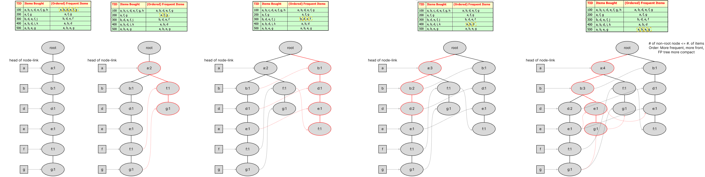

- Tree height: Max #. of frequent items in a transaction.
- Tree node #.: Bounded by the number of items in all transactions.
    - The reason why we put more frequent items in the beginning is to make the tree more compact.

### 5.1.3 Step 3: Conditional FP-Tree Construction

From the FP-tree above, construct the FP-conditional tree fore each item.

<details>

<summary>

#### Conditional FP-Tree for item "g"

</summary>

<description>

**I.** From the head of node-links, find all the "g" using the horizontal links.

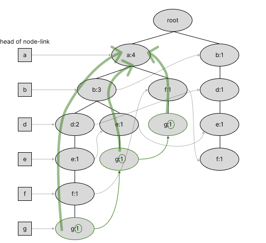

For each branch along the horizontal links, obtain the path to the root. For this example, we have:

| Items |
|-------|
| `{a: 1, b: 1, d: 1, e: 1, f: 1, g: 1}` |
| `{a: 1, b: 1, e: 1, g: 1}` |
| `{a: 1, f: 1, g: 1}` |

These are transactions related to "g". 

**II.** Create a frequency table according to the generated transaction. Like we did before, we'll filter out the large items.

<table>
<tr>
    <th>Item-Frequency</th>
    <th>Deduced Items</th>
</tr>
<tr><td>

| Item | Feq | Large? |
|------|-----|--------|
| a    | 3   | YES |
| b    | 2   | NO |
| d    | 1   | NO |
| e    | 2   | NO |
| f    | 2   | NO |
| g    | 3   | YES |

</td><td>

| Item | Feq |
|------|-----|
| a    | 3   |
| g    | 1   |

</td></tr> </table>

**III.** Then, we write the frequent items for each transactions in the **additional column.**

| Items | (Ordered) frequent Items |
|-------|--------------------------|
| `{a: 1, b: 1, d: 1, e: 1, f: 1, g: 1}` | `{a:1, g:1}` |
| `{a: 1, b: 1, e: 1, g: 1}` | `{a: 1, g: 1}` |
| `{a: 1, f: 1, g: 1}` | `{a: 1, g: 1}` |

(Conditional Pattern Base of "g")

Conceptually, we ignore "g" in the pattern base during construction of conditional FP-Tree.

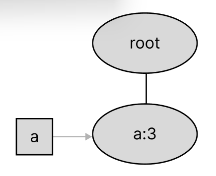


</description>

</details>


<details>

<summary>

#### Conditional FP-Tree for item "f"

</summary>

<description>

**I.** Find all transactions related to "f".

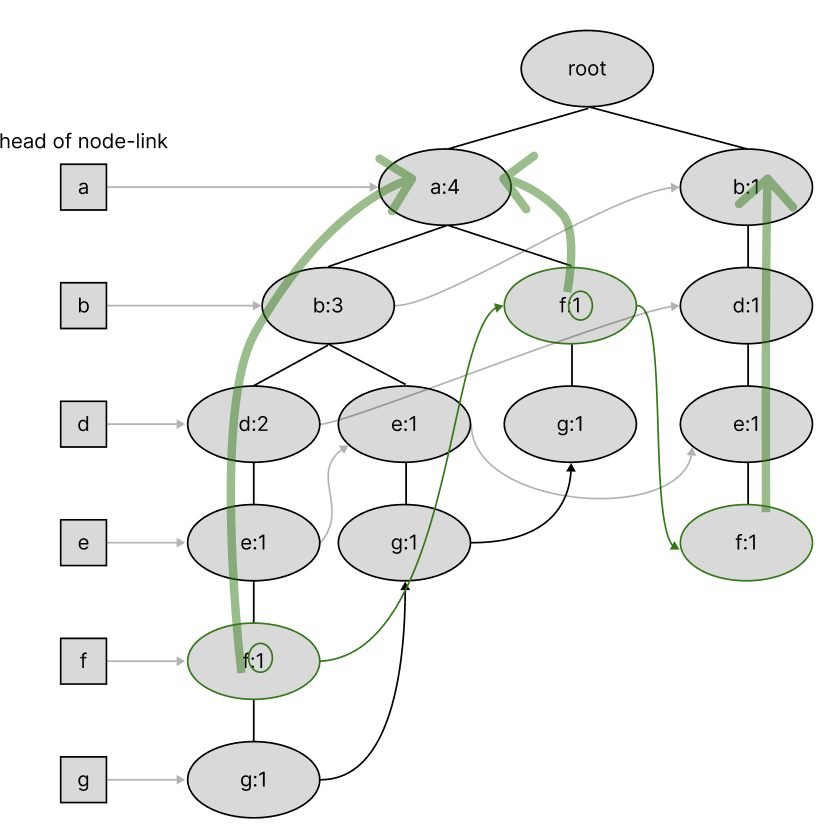

The transactions are:

| Items |
|-------|
| `{a: 1, b: 1, d: 1, e: 1, f: 1}` |
| `{a: 1, f: 1}` |
| `{b: 1, d: 1, e: 1, f: 1}` |

**II.** Create a frequency table with respect to the transactions. Filter out the large items.

<table>
<tr>
    <th>Item-Frequency</th>
    <th>Deduced Items</th>
</tr>
<tr><td>

| Item | Feq | Large? |
|------|-----|--------|
| a    | 2   | NO |
| b    | 2   | NO |
| d    | 2   | NO |
| e    | 2   | NO |
| f    | 3   | YES |
| g    | 0   | NO |

</td><td>

| Item | Feq |
|------|-----|
| f    | 3   |

</td></tr> </table>

**III.** Write frequent items for each transactions in the **additional column.**

| Items | (Ordered) Frequent Items |
|-------|--------------------------|
| `{a: 1, b: 1, d: 1, e: 1, f: 1}` | `{f: 1}` |
| `{a: 1, f: 1}` |  `{f: 1}` |
| `{b: 1, d: 1, e: 1, f: 1}` | `{f: 1}` |

Conceptually, we ignore "f" in the pattern base during cond-FP-tree construction. Therefore, in this special case, we obtain an empty tree.

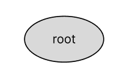

</description>

</details>


<details>

<summary>

#### Conditional FP-Tree for item "e"

</summary>

**I.** Find all transactions related to "e".

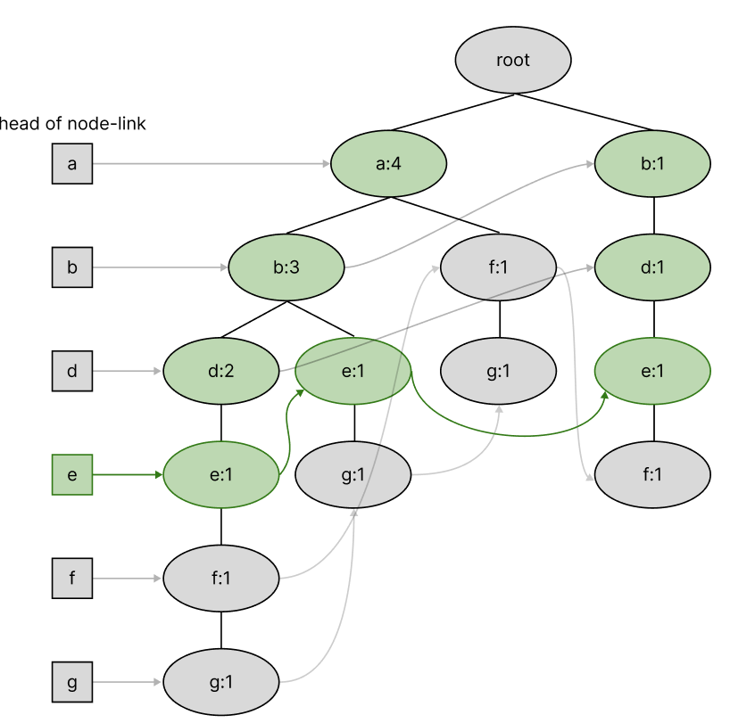

| Items |
|-------|
| `{a:1, b:1, d:1, e:1}` |
| `{a:1, b:1, e:1}` |
| `{b:1, d:1, e:1}` |

**II.** Create a frequency table with respect to the transactions. Filter out the large items.

<table>
<tr>
    <th>Item-Frequency</th>
    <th>Deduced Items</th>
</tr>
<tr><td>

| Item | Feq | Large? |
|------|-----|--------|
| a    | 2   | NO |
| b    | 3   | Yes |
| d    | 2   | NO |
| e    | 3   | Yes |
| f    | 0   | NO |
| g    | 0   | NO |

</td><td>

| Item | Feq |
|------|-----|
| b    | 3   |
| e    | 3   |

</td></tr> </table>

**III.** Write frequent items for each transactions in the **additional column.**

| Items | (Ordered) Frequent Items |
|-------|--------------------------|
| `{a:1, b:1, d:1, e:1}` | `{b:1, e:1}` |
| `{a:1, b:1, e:1}` | `{b:1, e:1}` |
| `{b:1, d:1, e:1}` | `{b:1, e:1}` |

Conceptually, we ignore "e" in the pattern base during cond-FP-tree construction. The conditional FP-Tree is:

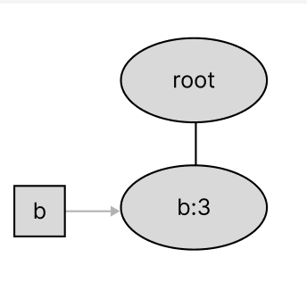

</details>


<details>

<summary>

#### Conditional FP-Tree for item "d"

</summary>

<description>

**I.** Find all transactions related to "d".

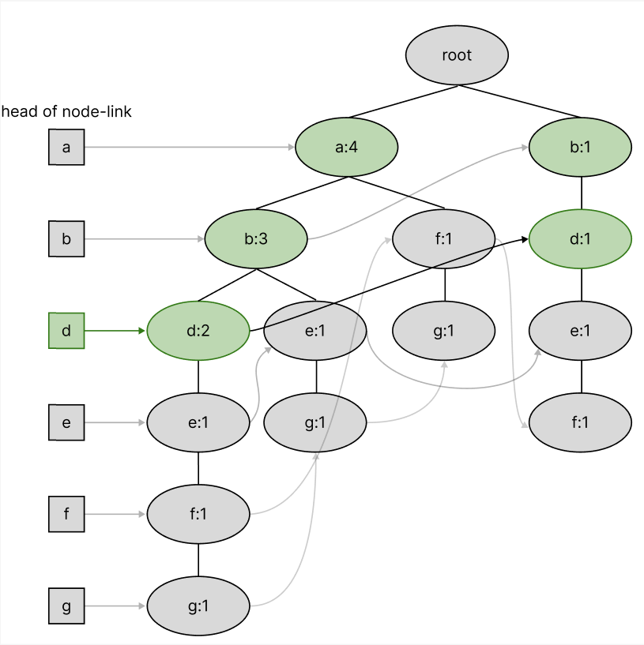

| Items |
|-------|
| `{a:2, d:2, b:2}` |
| `{b:1, d:1}` |

**II.** Create a frequency table with respect to the transactions. Filter out the large items.


<table>
<tr>
    <th>Item-Frequency</th>
    <th>Deduced Items</th>
</tr>
<tr><td>

| Item | Feq | Large? |
|------|-----|--------|
| a    | 2   | NO |
| b    | 3   | Yes |
| d    | 3   | YES |
| e    | 0   | NO |
| f    | 0   | NO |
| g    | 0   | NO |

</td><td>

| Item | Feq |
|------|-----|
| b    | 3   |
| d    | 3   |

</td></tr> </table>

**III.** Write frequent items for each transactions in the **additional column.**

| Items | (Ordered) Frequent Items |
|-------|--------------------------|
| `{a:2, d:2, b:2}` | `{b:2, d:2}` |
| `{b:1, d:1}` | `{d:1}` |

Ignore "d" in tree building. The conditional FP-Tree is:

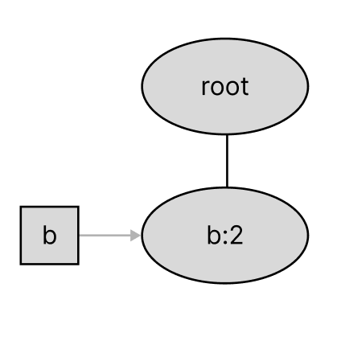

</description>

</details>


<details>

<summary>

#### Conditional FP-Tree for item "b"

</summary>

**I.** Find all transactions related to "b".

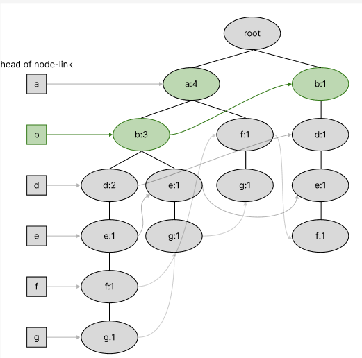

| Items |
|-------|
| `{a:3, b:3}` |
| `{b:1}` |

**II.** Create a frequency table with respect to the transactions. Filter out the large items.

<table>
<tr>
    <th>Item-Frequency</th>
    <th>Deduced Items</th>
</tr>
<tr><td>

| Item | Feq | Large? |
|------|-----|--------|
| a    | 3   | YES |
| b    | 4   | Yes |
| d    | 0   | NO |
| e    | 0   | NO |
| f    | 0   | NO |
| g    | 0   | NO |

</td><td>

| Item | Feq |
|------|-----|
| a    | 3   |
| b    | 4   |

</td></tr> </table>

**III.** Generate frequent items for each transactions in the **additional column.**

| Items | (Ordered) Frequent Items |
|-------|--------------------------|
| `{a:3, b:3}` | `{a:3, b:3}` |
| `{b:1}` | `{b:1}` |

Generate conditional FP-Tree:

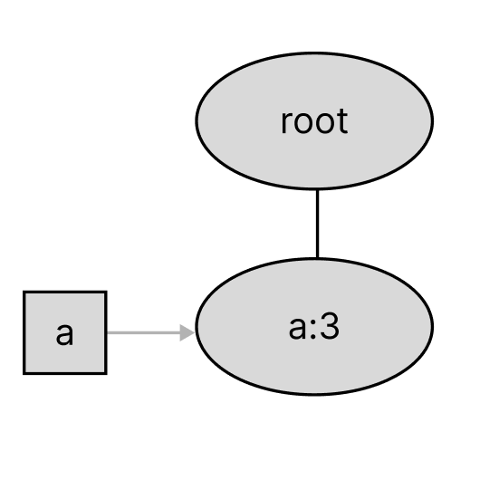
 
</details>


<details>

<summary>

#### Conditional FP-Tree for item "a"

</summary>

<description>

**I.** Find all transactions related to "a".

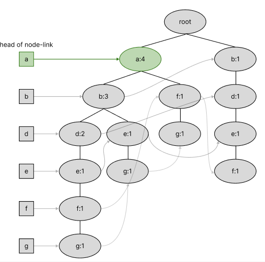

| Items |
|-------|
| `{a:4}` |

**II.** Create a frequency table with respect to the transactions. Filter out the large items.

<table>
<tr>
    <th>Item-Frequency</th>
    <th>Deduced Items</th>
</tr>
<tr><td>

| Item | Feq | Large? |
|------|-----|--------|
| a    | 4   | YES |
| b    | 0   | NO |
| d    | 0   | NO |
| e    | 0   | NO |
| f    | 0   | NO |
| g    | 0   | NO |

</td><td>

| Item | Feq |
|------|-----|
| a    | 4   |

</td></tr> </table>

**III.** Generate frequent items for each transactions in the **additional column.**

| Items | (Ordered) Frequent Items |
|-------|--------------------------|
| `{a:4}` | `{a:4}` |

Again, since we ignore the "a" in the pattern base and there's no other items, we obtain an empty tree.

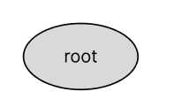 

</description>

</details>